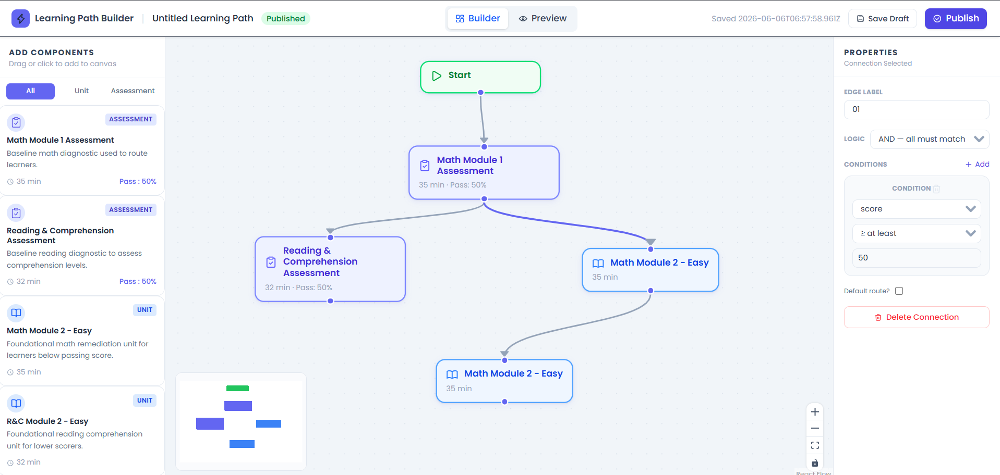
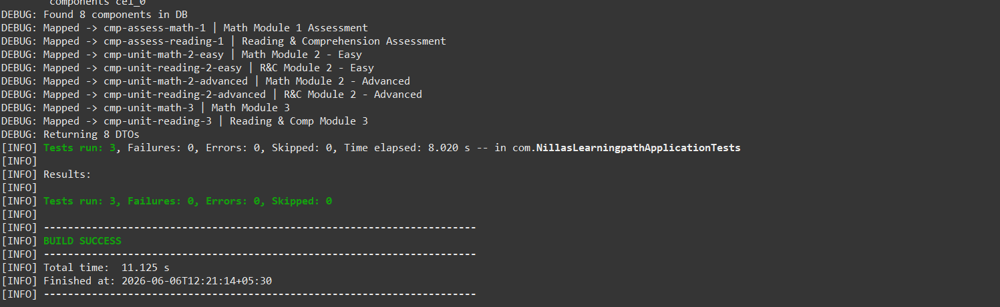

# Adaptive Learning Path Builder

A full-stack web application for curriculum designers to build adaptive learning paths visually — drag components onto a canvas, connect them with conditional routing logic, and save/reload paths via a REST API.

---

## Tech Stack

| Layer | Choice |
|---|---|
| Frontend | React 18 + TypeScript + Vite |
| Styling | Tailwind CSS |
| Canvas | @xyflow/react (React Flow v12) |
| State | Zustand |
| Backend | Java 17 + Spring Boot 3.2 |
| Database | H2 (in-memory) |
| Build | Maven |

---

## Project Structure

```
adaptive-learning-path-builder/
├── frontend/        # React + TypeScript + Vite
└── backend/         # Java + Spring Boot + H2
```

---

## Prerequisites

- Node.js >= 18
- Java 17+
- Maven 3.8+

---

## Setup & Run

### 1. Backend

```bash
cd backend
mvn spring-boot:run
```

Backend starts at **http://localhost:8080**

H2 console available at: http://localhost:8080/h2-console
- JDBC URL: `jdbc:h2:mem:alpdb`
- Username: `sa`, Password: *(empty)*

### 2. Frontend

```bash
cd frontend
npm install
npm run dev
```

Frontend starts at **http://localhost:5173**

> Vite proxies `/api/*` requests to `http://localhost:8080` automatically.

---

## API Endpoints

| Method | Endpoint | Description |
|---|---|---|
| GET | `/api/components` | Returns all available content components |
| POST | `/api/learning-paths` | Save a new learning path |
| GET | `/api/learning-paths/{id}` | Load a saved learning path |

### GET /api/components — Example Response

```json
{
  "items": [
    {
      "id": "cmp-assess-math-1",
      "title": "Math Module 1 Assessment",
      "shortDescription": "Baseline math diagnostic used to route learners.",
      "type": "assessment",
      "approximateDurationMinutes": 35,
      "metadata": {
        "assessment": { "maxScore": 100, "passingScore": 50 }
      }
    }
  ],
  "totalCount": 8
}
```

---

## Running Tests

### Backend Tests

```bash
cd backend
mvn test
```

Tests cover:
- Context loads correctly
- `GET /api/components` returns seeded data
- `POST /api/learning-paths` saves and `GET /api/learning-paths/{id}` reloads correctly

### Frontend Tests

```bash
cd frontend
npm test
```

Tests cover:
- Zustand store: add/update/remove nodes and edges
- Selection logic (node selection clears edge selection and vice versa)
- Path name and status updates

---

## Features

- **Drag & Drop** — Drag content components from left panel onto canvas
- **Node connections** — Draw directed edges between nodes
- **Conditional logic** — Click an edge to define routing rules (score range, completion, passed, etc.)
- **Properties panel** — Click any node or edge to edit its properties
- **Save Draft / Publish** — Persists to backend via REST API
- **Minimap + Controls** — Zoom, pan, reset view
- **Filter** — Filter left panel by unit / assessment type

---

## Screenshots

### Builder UI


### API Test Results  


### Test Results


---

## Library Choices

| Library | Reason |
|---|---|
| `@xyflow/react` | Industry-standard graph canvas with drag-and-drop, handles, minimap |
| `zustand` | Lightweight global state — no boilerplate, works great with React Flow |
| `axios` | Clean HTTP client with interceptor support |
| `lucide-react` | Consistent, lightweight icon set |
| `clsx` | Conditional className utility |
| `tailwindcss` | Utility-first CSS, matches design spec colors |

---

## Assumptions & Tradeoffs

1. **H2 in-memory DB** — Data resets on server restart. For production, swap to MySQL/PostgreSQL in `application.properties`.
2. **Nodes/edges stored as JSON** — Simpler persistence for the scope of this task. A graph DB or dedicated junction tables would scale better.
3. **No auth** — Out of scope for the assessment.
4. **React Flow node sync** — Canvas state is maintained in React Flow's internal state; synced to Zustand store on save.

---

## Time Spent

Approximately 1 working day.
